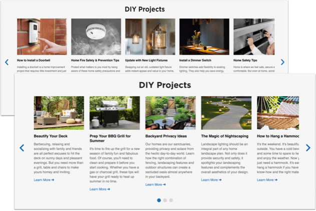
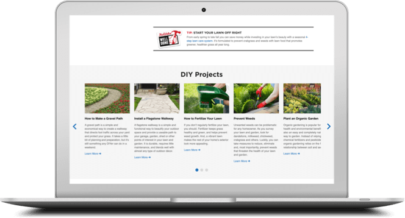

	
Organic search is an important source of inbound traffic for any site. Unfortunately, True Value's e-commerce site lacked content to capture customers at the top of the shopping funnel. Meanwhile, a moribund sister site TrueValueProjects.com contained hundreds of existing DIY articles that still received organic traffic.

	
In response to this, I initiated a project to reuse the existing content to amplify TrueValue.com, incorporating article snippets with the goals of improving SEO, increasing traffic and revenue, and enhancing customers' experience with the brand. I am also managing a long-term project to migrate the complete library to TrueValue.com.

	<table class="proj-details">
		<tr><td class="proj-details__label">My Roles:</td> <td class="proj-details__data">Sole Content Strategist, Designer &amp; Frontend Developer</td></tr>
		<tr><td class="proj-details__label">Stakeholders:</td> <td class="proj-details__data">E-Commerce Merchandisers &amp; Business Managers</td></tr>
		<tr><td class="proj-details__label">Skills Used:</td> <td class="proj-details__data">Project Management, Quantitative Research, Web Analytics, SEO, UX/UI Design, HTML, LESS/CSS, Javascript, Writing & Editing</td></tr>
		<tr><td class="proj-details__label">Applications:</td> <td class="proj-details__data">TrueValue.com &amp; TrueValueProjects.com</td></tr>
		<tr><td class="proj-details__label">Years:</td> <td class="proj-details__data">2019&ndash;2020</td></tr>
	</table>

	<figure style="margin-top: 3em; width: 100%; max-width: 1000px; display: block; margin-left: auto; margin-right: auto">
		
		<figcaption>The newly created modules on TrueValue.com featured articles from the sister site TrueValueProjects.com. The content snippets contributed copy, images, and links to otherwise minimal pages on the e-commerce site.</figcaption>
	</figure>

	<h2>Process</h2>
	<h3>Step 1: Analyze & Prioritize Content</h3>
	
I used <a href="https://marketingplatform.google.com/about/analytics/" target="_blank">Google Analytics</a> to identify the DIY articles on TrueValueProjects.com with the most organic visits, lowest bounce rate, and highest engagement. My main questions were:

	<ul>
		<li>What content was the most useful and effective for both customers and SEO?</li>
		<li>What content would drive the most traffic to the site?</li>
	</ul>
	
As it turned out, most of the top-performing subjects, such as how to remove mold or repair a porcelain sink, were outside the focus of marketing campaigns. This suggested that the articles&mdash;by serving diverse, specific interests&mdash;passively expanded the pool of customers and interactions.

	<h3>Step 2: Fix Broken Content</h3>
	
I noticed in Google Analytics that organic traffic to the sister site had dramatically decreased during the prior year, when the site was essentially unmaintained. I ran a broken link checker and found hundreds of broken links, which was poor for customers, SEO, and ultimately the brand. The rest of the e-commerce team pitched in to meticulously fix the broken links.

	<h3>Step 3: Design & Build Content Module</h3>
	
To incorporate the content on the e-commerce site, I modified existing code on TrueValue.com to create a slider module that displayed article snippets, with images, copy, and links. This involved HTML, LESS/CSS, and Javascript. Because selling products, not content, was the primary focus of the site, I designed the slider to be placed at the bottom of the category landing pages, below the on-page navigation.

	<h3>Step 4: Curate & Edit Content</h3>
	
I populated the sliders by curating dozens of articles to complement the main product categories on the site. I selected from the initial priority list, as well as a handful that related to popular products or internal search terms&mdash;signals of customer interest. To give the snippets a clean, modern look, I hunted through hundreds of new images and edited copy as needed. Later, when an SEO agency identified additional articles with top ranking keywords and click-through performance, I incorporated those in successive iterations.

	<h2>Epilogue</h2>
	
With limited resources for this self-driven initiative, I enhanced the e-commerce site and enabled it to present a fuller image of the brand. Along with other SEO improvements, such as sitemaps and metadata, this contributed to substantial increases in natural search visits, orders, and revenue year over year. I currently lead a project to refresh and migrate the articles to the e-commerce site and develop a long-term content strategy.
 

<aside class="proj-spotlight" style="margin-top: 4rem">
	

		

			<h2>Bonus Feature: "Well Done" Tips</h2>
		

		

			

				

					
Aware of my mission to incorporate more content, my colleague Cindy Groth suggested using the "Well Done" tips from the True Value circulars. These short tips gave advice on everything from fertilizing your lawn to power washing your patio to storing wet paint brushes. Her suggestion gave rise to our pollinating tips from print to digital.

				

			

			

				<figure>
					
				</figure>
			

		

	

</aside>
