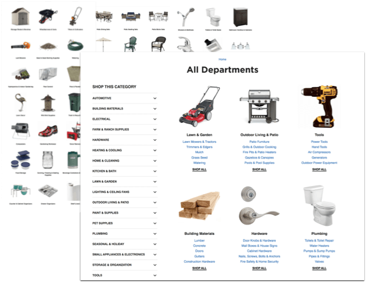

<section class="text-col">
	
According to customer feedback surveys, the biggest challenges for users of the True Value e-commerce site were navigation and product findability. And for site administrators, the size and complexity of the site increased the potential for error and made it difficult to optimize for internal search and SEO.

	
I initiated a couple projects to partially address these issues. My goal was to decrease the time and effort for users to find their desired destination and ultimately increase customer satisfaction and conversion.

	<figure>
		
		<figcaption></figcaption>
	</figure>
</section>