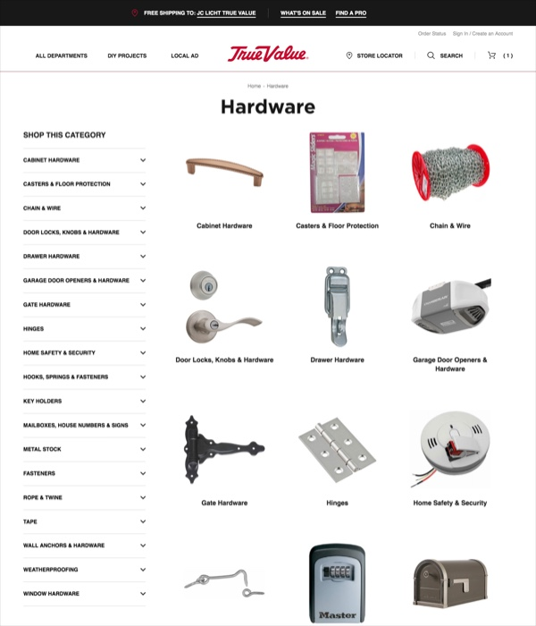

	
According to customer feedback surveys, the biggest frustrations for users of True Value's e-commerce site were navigation and product findability. <!-- And this had a magnifying effect: users who found it difficult to navigate and find products were twice as likely as all users to perceive an issue with the site. -->And because users can only buy what they can find, this issue could deeply impact the bottom line: sales.

	
In response to this issue, I initiated two projects&mdash;one still ongoing&mdash;to improve navigation and product findability. The first was to refine the visual cues and add shortcuts to popular categories, and the second was to streamline the product taxonomy, which served as the basis for the site structure. My goal was to decrease the time and effort for users to find their destinations and ultimately to increase sales.

	<table class="proj-details">
		<tr><td class="proj-details__label">My Roles:</td> <td class="proj-details__data"><!-- Advocate &middot;  -->Sole Information Architect, Designer & Frontend Developer</td></tr>
		<tr><td class="proj-details__label">Stakeholders:</td> <td class="proj-details__data">E-Commerce Merchandisers & Business Managers</td></tr>
		<tr><td class="proj-details__label">Skills Used:</td> <td class="proj-details__data">Project Management &middot; Quantitative Research &middot; Web Analytics &middot; SEO &middot; UX/UI Design &middot; HTML &middot; LESS/CSS</td></tr>
		<tr><td class="proj-details__label">Applications:</td> <td class="proj-details__data">TrueValue.com</td></tr>
		<tr><td class="proj-details__label">Years:</td> <td class="proj-details__data">2018&ndash;2019</td></tr>
	</table>

	<figure style="margin-top: 3em; width: 100%; max-width: 1000px; display: block; margin-left: auto; margin-right: auto">
		
		<figcaption>I curated thousands of category images and links to improve information scent and ease navigation and product findability.</figcaption>
	</figure>

	<h2>Process</h2>
	<h3>Step 1: Identify Pain Points & Prioritize Effort</h3>
	
True Value's e-commerce site contained thousands of product categories, some of them six levels deep and many of them duplicates. Not only could this complexity create navigational challenges for users, but for site administrators, it made the products difficult to organize and the categories difficult to maintain for SEO.

	
To better understand where users were getting frustrated, I used <a href="https://www.adobe.com/analytics/adobe-analytics.html" target="_blank">Adobe Analytics</a> to look for patterns and outliers in users' behavior. My main questions were:

	<ol>
		<li>Which categories were unclear, misplaced, too large, or too small?</li>
		<li>Which categories did users spend a long time choosing their path, and why? Naming? Visual cues? Too many options? Irrelevant options?</li>
		<li>Given the volume of product categories, where should we focus our improvements for the greatest return?</li>
	</ol>
	
To answer these questions, I analyzed visits, time spent on-page, most popular sellers, and most popular search terms.<!--  Some unexpected findings emerged: --> An unexpected finding was that marketing tactics&mdash;such as emails, digital ads, and promotional banners&mdash;substantially skewed visits to some categories over others, but when users navigated the site on their own, their visits distributed more evenly across the categories.

	<!-- <ul>
		<li>Many desktop users started browsing the site at the highest level of the product taxonomy (“All Departments”), rather than skipping to lower levels through the megamenu. This suggested that we should dedicate special attention to that high-level page.</li>
		<li>Marketing campaigns had a dramatic effect on the distribution of visits across categories. When subtracting that effect, the distribution of visits spanned more evenly across core hardware categories. This contradicted common notions of which categories were "more important" and suggested that we should spread our effort widely, if shallowly.</li>
	</ul> -->
	<h3>Step 2: Research Best Practices</h3>
	
To research best practices in information architecture, I sought out education and expert advice for <!-- me and the rest of  -->the e-commerce team. I attended an Information Architecture training by the <a href="https://www.nngroup.com/" target="_blank">NN/g Nielson Norman Group</a>, which introduced me and a colleague to card sorting, tree analysis, and other tools and techniques. I also reached out to experts in the field&mdash;content and taxonomy specialists who provided <!-- learning and discovery discussions for the entire team -->advice specific to our implementation.

	
During this process, I proposed to the team that we hire consultants to optimize the taxonomy for us. My reasoning was that as experts, they could do a better job faster, and as <i>third-party</i> experts, they could bring a fresh perspective and break through the inertia and reluctance that repeatedly settled in-house. With input from marketing analytics and the finance department, we developed a model that demonstrated a multi-fold ROI, and we submitted a business case to request investment from senior leadership.

	<h3>Step 3: Curate &amp; Edit Content: Thumbnail Images</h3>
	
In the meantime, I continued with activities that <!-- were within my control and --> did not require  <!-- dedicated budget.Without changing the taxonomy or megamenu, what could I do to help users navigate the site? Improve visual cues. -->major changes to the taxonomy: refining the visual cues and adding shortcuts to popular categories.

	
The thousands of category thumbnails comprising on-page navigation had been randomly assigned, not deliberately curated to help users understand the site. In some cases, the category thumbnail showed a product obscured by packaging; in other cases, it showed an accessory rather than the main product type itself; while in still other cases, it showed a lifestyle vignette while a neighboring thumbnail showed a product in silhouette. Besides giving unclear navigational cues, the thumbnails had no aesthetic continuity<!-- , which was unpleasant and incoherent to the eye -->.

	
Over the next few months, I refreshed thousands of thumbnails, swapping old ones for new ones. During this process, I also replaced generic file names (e.g., 827492.jpg) with more descriptive names (e.g., 232677-weber-spirit-gas-grill.jpg) for better SEO. With hundreds of thousands of images to choose from, my goal was to select images that were quick and easy for users to understand and represented the brand well. Therefore, I sought out clean, quality images of best-selling, high-end, or well-rated products that symbolized the main concepts of their parent categories.

	

		

			<figure class="before-after-container">
				<figcaption>
					<i class="fa fa-times-circle" aria-hidden="true"></i>Before
					Old platform (early 2018)
				</figcaption>
				
			</figure>
		

		

			<figure class="before-after-container">
				<figcaption>
					In Transition
					New platform, old images (mid-2018)
				</figcaption>
				
			</figure>
		

		

			<figure class="before-after-container">
				<figcaption>
					<i class="fa fa-check-circle" aria-hidden="true"></i>After (Phase 1)
					New images (early 2019)
				</figcaption>
				
			</figure>
		

	

	<h3>Step 4: Curate &amp; Edit MORE Content: Category Sublinks</h3>
	
In order to facilitate quicker navigation and improve information scent on the highest level categories, I decided to list some of the key subcategory links as shortcuts beneath the thumbnail images. Given that some categories had a dozen or more subcategories, which ones deserved to be listed without overwhelming or cluttering the page? Which shortcuts would be most useful?

	
To address this, I used Adobe Analytics to identify the subcategories that received the most visits on the site and our BI data warehouse to identify the best-selling product lines, in revenue and volume, on both the site and the stores. These metrics served as indicators of the subcategories with the most value, to customers and the business. I then curated the sublinks, usually three to five per thumbnail, based on which appeared to have the most value. Adding them to the site required HTML and LESS/CSS.
 

	

		

			<!-- <figure class="before-after-container">
				<figcaption>
					<i class="fa fa-times-circle" aria-hidden="true"></i>Before
					Original Hardware page (early 2018)
				</figcaption>
				
			</figure> -->
			<figure class="before-after-container">
				<figcaption>
					<i class="fa fa-times-circle" aria-hidden="true"></i>Before (Phase 1)
					Initial new images (early 2019)
				</figcaption>
				
			</figure>
		

		

			<figure class="before-after-container">
				<figcaption>
					<i class="fa fa-check-circle" aria-hidden="true"></i>After (Phase 2)
					Revised new images with shortcuts (mid-2019)
				</figcaption>
				
			</figure>
		

	

	<!-- 

		

			<figure class="before-after-container">
				<figcaption>
					<i class="fa fa-times-circle" aria-hidden="true"></i>Before
					Original Building Materials page (early 2018)
				</figcaption>
				
			</figure>
		

		

			<figure class="before-after-container">
				<figcaption>
					<i class="fa fa-check-circle" aria-hidden="true"></i>After
					Revised Building Materials page (mid-2019)
				</figcaption>
				
			</figure>
		

	
 -->
	<!-- 

		

			<figure class="before-after-container">
				<figcaption>
					<i class="fa fa-times-circle" aria-hidden="true"></i>Before
					Original Electrical page (early 2018)
				</figcaption>
				
			</figure>
		

		

			<figure class="before-after-container">
				<figcaption>
					<i class="fa fa-check-circle" aria-hidden="true"></i>After
					Revised Electrical page (mid-2019)
				</figcaption>
				
			</figure>
		

	
 -->

	
During this process, I reordered the subcategories based on visits and sales, placing the most popular at the top. I also started to build collage images for subcategories that contained multiple types of product or whose labels might be unclear. For example, the thumbnail for "Home Safety & Security" showed a fire extinguisher, bike lock, and security camera, and the thumbnail for "Fasteners" showed a screw, nails, and hex nuts.

	<h2>Epilogue</h2>
	
After these efforts to improve information scent, customer satisfication in key categories increased by 30%. With thousands of categories and more added very month, this project evolved into ongoing maintenance. In parallel, I continue to spearhead efforts to streamline the overall taxonomy, which <!-- I believe  -->will drive even bigger benefits for usability, customer satisficaton, and ultimately revenue.

