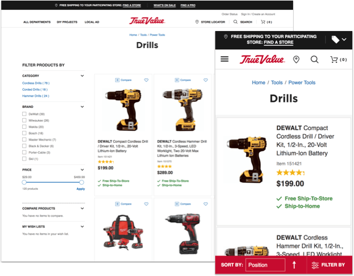
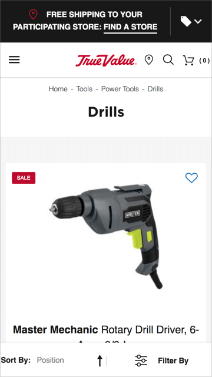
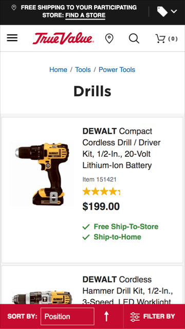
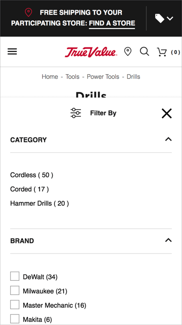
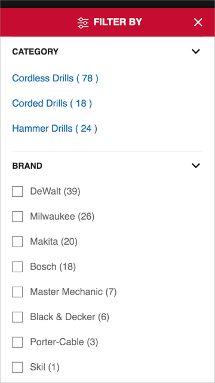

	
True Value stores take pride in placing customers first&mdash;offering convenience and service that help customers achieve a job well done. Unlike that easy, in-store experience, usability studies showed that many parts of the True Value e-commerce site were awkward, unclear, and potentially difficult for customers to use.

	
I initiated projects to reduce friction on the site and polish the presentation of the brand. Over the course of several months, I reskinned key parts of the shopping, checkout, and order status experiences, as well as the transactional emails. My goal was to improve the overall customer experience and ultimately increase conversion and sales.

	<table class="proj-details">
		<tr><td class="proj-details__label">My Roles:</td> <td class="proj-details__data">Advocate &middot; Sole Designer and Frontend Developer</td></tr>
		<tr><td class="proj-details__label">Skills Used:</td> <td class="proj-details__data">UX/UI Design &middot; Material IO &middot; WCAG &middot; HTML &middot; LESS/CSS</td></tr>
		<tr><td class="proj-details__label">Application:</td> <td class="proj-details__data">TrueValue.com</td></tr>
		<tr><td class="proj-details__label">Years:</td> <td class="proj-details__data">2019&ndash;2020</td></tr>
	</table>

	<figure style="margin-top: 2em; width: 100%; max-width: 1000px; display: block; margin-left: auto; margin-right: auto">
		
		<figcaption>The desktop and mobile versions of this reskinned product listing page addressed different needs, while sharing a similar look and feel.</figcaption>
	</figure>

	<h2>Process</h2>
	<h3>Step 1: Identify Pain Points</h3>
	
At the start of the project, I had no tools to analyze or test customers' behavior on the site. However, a third party had conducted usability studies on the site a year before. The studies highlighted points of friction, many of which were related to information hierarchy and information density. For example, large hero images on category landing pages pushed the  main content below the page fold, disorienting users as they navigated the site. And excess white space on product listing pages caused related information to look disconnected, rather than logically grouped. These findings served as the initial basis of the project.
 
	<h3>Step 2: Research Best Practices</h3>
	
To supplement the usability studies, I investigated the <a href="https://baymard.com/" target="_blank">Baymard Institute</a>, <a href="https://www.nngroup.com/" target="_blank">NN/g Nielson Norman Group</a>, and other resources for data-driven insights and best practices in e-commerce UX design. They provided extensive recommendations&mdash;many of which, unfortunately, were out of scope for this project&mdash;along with concrete examples of Do's and Don'ts. This was also an opportunity to ensure that at least visual aspects of the site adhered with <a href="https://www.w3.org/WAI/standards-guidelines/wcag/" target="_blank">WCAG</a>.
 
	
For additional inspiration, I examined design systems, especially  <a href="https://material.io/" target="_blank">Material IO</a> for its completeness and emphasis on mobile. The True Value site was particularly hard to use on mobile: the touch targets were too small, the sticky header consumed too much space, and information in the product lists did not fit the viewport, among other things. At the same time, mobile visits made up an increasing majority of visits to the site, so addressing these issues could have a positive impact on a lot of customers.

	<h3>Step 3: Create Design Concepts</h3>
	
Armed with research, I created design concepts, focusing on pages and elements that received the most use, such as the header, category landing pages, product listing pages, and product detail pages. I maintained the original aesthetic, so that each modified part would look unified with the site as a whole. But my main objective was to make it clean, orderly, and functional&mdash;like a well-run hardware store, easy in and out. After putting together some concepts, I reviewed them with the rest of the e-commerce team.

	<h3>Step 4: Build New Skin</h3>
	
Reskinning the site required changes to the frontend styling, which I built with LESS and CSS. One of the biggest constraints of the project was not having access to the base code, which prevented me from making changes to the templates or scripts. This was a major reason for not incorporating more changes from my research, but nevertheless, I could still accomplish many improvements through styling. The rest of the e-commerce team helped test the changes in staging and production.

	<h3>Step 5: Iterate & Refine</h3>
	
Over the course of several months, I refined the initial changes and repeated the process on other parts of the site, including checkout, order status lookup, and transactional emails. Ideally, if resources had been available, I would have tested different solutions with an A/B testing tool and attempted to measure the effects on conversion and sales. But I continued to learn through other avenues, including <a href="https://www.hotjar.com/" target="_blank">Hotjar</a> recordings and feedback from Customer Service, so we moved forward as best we could.

<aside class="proj-spotlight" style="margin-top: 4rem">
	

		

			<h2>Project Spotlight: Mobile Product Listing Page</h2>
		

		

			

				

					
The scope of the project included both desktop and mobile, but many of the changes were specific to mobile and its unique usability challenges. For example, on the product listing page, I performed the following:

					<ol>
						<li>Shortened the height of the fixed header to increase the visibility of the main content.</li>
						<li>Increased the size and spacing of the touch targets in the header for easier tapping.</li>
						<li>Differentiated the breadcrumb links from static text and increased the size and spacing for easier tapping. Also removed the redundent link to the current page to reduce clutter.</li>
						<li>Condensed the information in the product listing so that each product image and related details appeared in the same view.</li>
						<li>Differentiated the toolbar from the rest of the page and refined its interior elements.</li>
					</ol>
				

			

			

				<figure class="before-after-container">
					<figcaption class="before-label">
						<i class="fa fa-times-circle" aria-hidden="true"></i>Before
					</figcaption>
					
				</figure>
			

			

				<figure class="before-after-container">
					<figcaption class="after-label">
						<i class="fa fa-check-circle" aria-hidden="true"></i>After
					</figcaption>
					
				</figure>
			

		

		

			

				

					
The toolbar drawer on the product listing page required specific changes as well:

					<ol>
						<li>Differented the toolbar drawer from the background page, which visually bled together.</li>
						<li>Increased the height of the drawer to maximize the visibility of its contents and reduce the need for scrolling.</li>
						<li>Differentiated the category links from static text.</li>
						<li>Increased the spacing between the links and selection controls for easier tapping.</li>
					</ol>
				

			

			

				<figure class="before-after-container">
					<figcaption class="before-label">
						<i class="fa fa-times-circle" aria-hidden="true"></i>Before
					</figcaption>
					
				</figure>
			

			

				<figure class="before-after-container">
					<figcaption class="after-label">
						<i class="fa fa-check-circle" aria-hidden="true"></i>After
					</figcaption>
					
				</figure>
			

		

	

</aside>